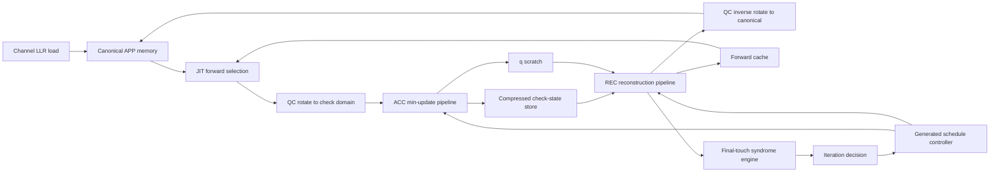

# 5G NR QC-LDPC Decoder Core

Production-oriented SystemVerilog RTL and Python reference models for a frozen
5G NR QC-LDPC layered Offset-Min-Sum decoder core.

| Item | Status |
| --- | --- |
| Production core | Functionally complete for the frozen BG1 Z=384 reference profile |
| Top module | `rtl/core/nr_ldpc_decoder_core.sv` |
| Algorithm | Layered Offset-Min-Sum with final-touch streaming syndrome checking |
| Fixed-point profile | CH6 / APP8 / q8 / M6, gain 1.32, channel-to-APP shift 1, beta_int 1 |
| RTL verification | Phase 1 through Phase 9 pass, including three-iteration retry ping-pong |
| Python regression | 76 tests pass |
| Open-source synthesis | Verilator lint/elaboration and Yosys generic synthesis pass |
| UltraScale+ analysis | Yosys `synth_xilinx -family xcup` bounded checkpoint passes |
| FPGA Fmax | XCZU67DR post-route Fmax is NOT MEASURED |

## Frozen Reference Configuration

```text
Base graph: BG1
Lifting size: Z=384
iLS: 1
Active layers: 0,1,2,3
Layer order: 1,3,2,0
Parallelism P: 384 lanes
Issue width B: 2 QC edges/cycle
ACC depth DA: 3
REC depth DR: 3
APP banks: 8
Forward cache depth: 8
Syndrome engine: S=8, Q=8
```

The checked-in graph tables are under `data/NR-LDPC-BG`. They are sourced from
`https://github.com/manuts/NR-LDPC-BG` at commit
`910ecbc9e81d43e318079aec535dc9a166a76b2a`.

Synthetic graph fixtures are retained only for regression tests and are not
reported as 3GPP base-graph results.

## Architecture



Major RTL blocks:

| Area | Files |
| --- | --- |
| Common package/arithmetic | `rtl/common/` |
| QC permutation | `rtl/qc/` |
| Compressed C2V reconstruction | `rtl/check_state/` |
| ACC datapath | `rtl/acc/` |
| REC datapath | `rtl/rec/` |
| Storage and forwarding | `rtl/storage/` |
| Syndrome engine/profile | `rtl/syndrome/` |
| Controller/profile | `rtl/control/` |
| Integrated datapaths and top | `rtl/core/` |
| Testbenches | `rtl/tb/` |

`rtl_prototypes/` contains older isolated physical-experiment kernels. Those
files are not the production decoder RTL.

## Fixed-Point Semantics

Frozen width family F:

```text
CH = 6
APP = 8
q = 8
M = 6
channel gain = 1.32
channel-to-APP shift = 1
beta_int = 1
saturation = asymmetric two's-complement
```

Preserved arithmetic behavior:

- `APP_initial = sat8(CH6 << 1)`
- `q = sat8(APP - oldC2V)`
- `q = -128` converts to magnitude 128 and clips to M6 63
- `beta = max(raw_mag - 1, 0)`
- C2V negative zero is suppressed
- `APP = sat8(q + C2V)`

## Measured Cycle Latency

Functional RTL simulation measures:

```text
decoder issue window = 71 cycles
syndrome boundary = 72 cycles
one-iteration controller done = 73 cycles
retry PC0-to-PC0 spacing = 74 cycles
```

Physical latency is therefore:

```text
71 / Fclock
72 / Fclock
73 / Fclock
74 / Fclock
```

`Fclock` awaits a supported target FPGA implementation flow.

XCZU67DR post-route Fmax = NOT MEASURED.

## Verification Status

Accepted regression evidence:

```text
Phase 1: PASS phase1 arithmetic primitives
Phase 2: PASS phase2 qc permutation
Phase 2 Python QC: PASS, 14208 observed SV lane rows checked
Phase 3: PASS phase3 compressed c2v reconstruction
  scalar_cases=32768
  vector_cases=116
  explicit_edges_checked=96
Category B: CATEGORY B CLOSED - INTEGRATED DATAPATH RTL AUTHORIZED
Phase 4: PASS phase4 ACC, order_independence_cases=16384
Phase 5: PASS phase5 REC
Phase 6: PASS phase6 storage, decoder_cycles=71
Phase 7: PASS phase7 APP forwarding, decoder_cycles=71
Phase 8: PASS phase8 streaming syndrome, syndrome_completion_cycle=72
Phase 9: PASS selected-case decoder-core sweep including three-iteration retry
Full Python: 76 passed
```

Phase 9 selected-case coverage verifies:

```text
one-iteration terminal done = 73
two-iteration PC0 sequence = 0,74
two-iteration terminal done = 147
three-iteration PC0 sequence = 0,74,148
three-iteration terminal done = 221
generation advances = 2
epochs = 0,1,2
ACC = 120 issues / 228 active edges
REC = 120 issues / 228 active edges
```

## Reproducing The Release Checks

From the repository root, use tools from `PATH` or set these optional
environment variables:

```powershell
$env:PYTHON = "python"
$env:IVERILOG = "iverilog"
$env:VVP = "vvp"
$env:OSS_CAD_SUITE = "<path-to-oss-cad-suite>"
$env:YOSYS = "yosys"
$env:VERILATOR = "verilator_bin.exe"
```

If using OSS CAD Suite on Windows, initialize it before Yosys or Verilator:

```powershell
. "$env:OSS_CAD_SUITE\environment.ps1"
```

Run the Python regression:

```powershell
.\scripts\run_python_regression.ps1
```

Run the selected Phase 9 decoder-core sweep:

```powershell
.\scripts\run_phase9_regression.ps1
```

Run Phase 1 through Phase 9 RTL regression:

```powershell
.\scripts\run_full_rtl_regression.ps1
```

Run both Python and RTL regressions:

```powershell
.\scripts\run_full_regression.ps1
```

Run Verilator lint/elaboration:

```powershell
.\scripts\run_verilator.ps1
```

Run Yosys generic synthesis:

```powershell
.\scripts\run_yosys_generic.ps1
```

Run the bounded UltraScale+ checkpoint:

```powershell
.\scripts\run_yosys_xcup_checkpoint.ps1
```

Generated simulator binaries and local logs are intentionally ignored by git.

## Free/Open-Source Tool Validation

The release was validated with free/open-source tools:

```text
Python 3.12.13
Icarus Verilog 12.0 devel
Verilator 5.051 devel
Yosys 0.68+136 with read_slang
OSS CAD Suite 20260830
```

Reports:

```text
results/free_tool_validation/toolchain_versions.md
results/free_tool_validation/verilator_report.md
results/free_tool_validation/yosys_generic_report.md
results/free_tool_validation/yosys_xcup_report.md
results/final/final_decoder_report.md
RELEASE_STATUS.md
```

Yosys generic synthesis result:

```text
Build succeeded: 0 errors, 0 warnings
Found and reported 0 problems
memories = 38
memory bits = 3023808
cells = 145928
```

The bounded xcup checkpoint also elaborates cleanly and preserves the inferred
memory fabric. Full final primitive mapping for the 384-lane core did not
complete on the recorded host/toolchain, so complete LUT/FF/BRAM/DSP/SRL
resource numbers are not claimed.

## FPGA Physical Implementation Status

The decoder RTL core is functionally complete and verified.

Free/open-source synthesis and UltraScale+ technology-mapping analysis have
been performed.

XCZU67DR-specific placement/routing, timing closure, post-route Fmax, vendor
utilization, and power remain unmeasured because the required target-specific
physical implementation flow is outside the project's 100% free/open-source
tooling constraint.

This is a tooling/platform validation limitation, not a functional decoder
failure.

## Industrial Reference

The architecture studies compare against:

```text
L_IPCTEK = 78 + 133N cycles
```

For `N=6`, this is 876 cycles. The production reference core's accepted retry
spacing is 74 cycles/iteration, so iteration-dependent latency is measured in
RTL, while physical clock frequency remains unmeasured.
