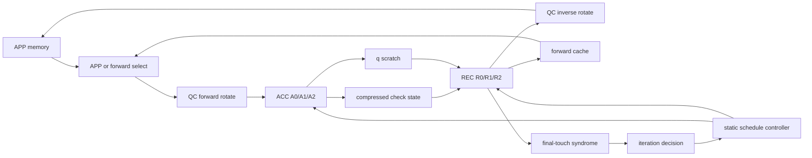

# Architecture Guide

This guide explains the frozen decoder architecture before reading the RTL.
The Canonical RTL Implementation Specification v1.1 remains the normative
implementation authority; this document is a repository-grounded engineering
guide for the completed RTL core and its checked regression evidence.

## Objective

The project implements a latency-first 5G NR QC-LDPC decoder core for one
frozen high-rate reference profile:

```text
BG1, Z=384, iLS=1, active layers 0,1,2,3
layer order = 1,3,2,0
P=384, B=2, DA=3, DR=3
APP banks=8, forward cache depth=8
syndrome S=8, syndrome Q=8
```

The dominant design metric is actual decoding latency, not isolated datapath
throughput. The architecture accepts a 71-cycle decoder issue window, a
72-cycle syndrome boundary, a 73-cycle one-iteration done pulse, and a
74-cycle retry PC0-to-PC0 interval. The 74-cycle retry spacing is frozen for
this functional release.

## 5G NR QC-LDPC Context

5G NR LDPC uses base graphs expanded by a lifting size `Z`. Each nonnegative
base-matrix entry represents a circulant permutation. For the production
reference profile, `P=Z=384`, so every QC edge is processed as one full
384-lane vector. The real graph data used by the repository lives in
`data/NR-LDPC-BG`, and the production profile uses the first four active BG1
layers.

The production RTL core is not a full 5G receiver. Rate matching, filler
handling, segmentation, CRC, PCIe/DMA transport, and host orchestration remain
external integration work.

## Why Layered Offset Min-Sum

Layered decoding updates APP values after each layer rather than waiting for a
whole flooding iteration. That improves convergence latency because later
layers consume newer APP information. Offset Min-Sum was selected because it
keeps check-node processing simple enough for a wide vector pipeline while
preserving the fixed-point behavior validated by the Python numerical studies.

The frozen fixed-point profile is:

```text
CH=6, APP=8, q=8, M=6
channel gain=1.32
channel-to-APP shift=1
beta_int=1
asymmetric two's-complement saturation
```

## Frozen DA-2B-OMS Architecture

The shorthand DA-2B-OMS describes the key issue structure:

- `DA=3`: three-stage accumulation pipeline.
- `DR=3`: three-stage reconstruction pipeline.
- `B=2`: up to two QC edges issue per ACC or REC cycle.
- OMS: fixed-point layered Offset Min-Sum.

The high-rate profile has 19 active QC edges in each of four layers. With
`B=2`, each layer needs 10 issue slots, including one singleton slot. The
complete schedule contains 40 ACC issue cycles and 40 REC issue cycles
overlapped into a 71-cycle program.

## Why P=384, B=2, DA=3, DR=3

`P=384` processes one full lifted circulant at once for the frozen `Z=384`
profile. This removes sub-vector strip-mining from the reference core and keeps
the schedule cycle count low.

`B=2` balances issue parallelism with dependency pressure and memory banking.
Earlier architecture studies kept B=2 as the production point; B=4 is not part
of this frozen core.

`DA=3` and `DR=3` provide explicit stage boundaries for QC rotation, old/new
message arithmetic, compressed-state updates, APP writeback, forwarding, and
final-touch syndrome emission. The accepted timing assumes these three-stage
visibility rules.

## Full Iteration Dataflow



An ACC issue reads the current APP for each active edge, subtracts the old C2V
message, writes q, and accumulates minima/sign state. A REC issue waits for the
layer's new compressed state, reconstructs the new C2V message, adds it back
to q, commits the new APP value, and optionally publishes a forward vector and
final-touch hard decision.

## ACC Pipeline

The ACC pipeline is `rtl/acc/nr_ldpc_acc_pipeline.sv`.

- A0 latches the schedule token, selects ordinary APP or a forward slot, and
  rotates canonical APP into check-domain order.
- A1 reconstructs old C2V from the old generation, computes
  `q = sat8(APP - oldC2V)`, and forms the q sign and magnitude.
- A2 updates the order-independent min1/min2/Imin/aggregate-sign context,
  writes q scratch and q signs, and closes the layer when its degree is met.

There are two ACC contexts so one layer can continue accumulating while a
previous layer is being reconstructed.

## REC Pipeline

The REC pipeline is `rtl/rec/nr_ldpc_rec_pipeline.sv`.

- R0 reads q and the newly closed compressed state, then reconstructs C2V.
- R1 computes `APP = sat8(q + C2V)`.
- R2 inverse-rotates the APP vector back to canonical order, commits it to APP
  memory, publishes any forward-cache vector, and emits final-touch hard bits.

REC uses the new generation for its layer. ACC uses the old generation, except
for the Phase 9 adapter that translates only the internal old-state lookup to
the previous epoch after iteration 0.

## q Scratch

`rtl/storage/nr_ldpc_q_scratch.sv` stores q vectors between ACC and REC. The
production profile uses two q buffers and ten q slots per buffer, matching the
degree-19, B=2 layer schedule. The store validates q slot ownership, metadata,
read validity, release, and unsafe generation advance.

Payload arrays are not bulk reset. Validity, ownership, and error metadata are
reset and checked.

## Compressed C2V And Check State

The check-state representation stores per layer and lane:

```text
M1 offset magnitude
M2 offset magnitude
Imin local edge ID
aggregate sign
per-edge q sign
```

This is sufficient to reconstruct every C2V value exactly for Offset Min-Sum.
`rtl/check_state/nr_ldpc_c2v_reconstruct.sv` performs the lane/vector
reconstruction, while `rtl/storage/nr_ldpc_check_state_store.sv` owns the
old/new generation storage and epoch checks.

The first iteration logically sees zero old C2V. Later iterations read the
previous generation through the epoch/generation contract.

## APP Memory

`rtl/storage/nr_ldpc_app_memory.sv` stores canonical APP vectors by active base
column. The production configuration has eight logical APP banks. The schedule
avoids ordinary same-bank read conflicts; R2 same-bank write/read timing is
handled by the forwarding model rather than relying on vendor RAM
read-during-write behavior.

APP memory accepts initial APP loads, ordinary reads for ACC, and writeback
from REC. It flags inactive columns, missing loads, duplicate writes, invalid
reads, and duplicate write lanes.

## Dependency-Aware JIT Forwarding

The schedule and `rtl/storage/nr_ldpc_forward_cache.sv` cooperate to avoid RAW
stalls. A REC issue at cycle `c` produces a forward candidate visible at
`c+3`. The ordinary APP memory value is modeled as safe for later ACC reads at
`c+4`. If a dependent ACC needs the just-produced APP at `c+3`, the schedule
names a forward slot instead of reading ordinary APP.

The Phase 7 integrated evidence reports:

```text
forward_allocations=50
forwarded_reads=27
normal_reads=49
max_live_forward_entries=8
same_bank_collisions=4
decoder_cycles=71
```

## QC Permutation

`rtl/qc/nr_ldpc_qc_permute.sv` implements the frozen direction:

```text
forward: check[k] = canonical[(k+s) mod 384]
inverse: canonical[k] = check[(k-s) mod 384]
```

Lane packing is `vector[k*LANE_W +: LANE_W]`. General `Z<384` is not supported
by this production RTL release.

## Syndrome Engine

The streaming syndrome engine consumes final-touch hard-decision vectors as
soon as each active APP column becomes final. It processes up to `S=8` QC-edge
contributions per cycle and uses a finalized-column queue with `Q=8` entries.

For the reference profile:

```text
finalized columns = 26
consumed work items = 76
first final touch = 53
last final touch = 71
max queue occupancy = 2
max backlog = 7
syndrome completion = 72
syndrome tail = 1
```

The syndrome engine observes the final APP generation only; it does not feed
back into ACC or REC arithmetic.

## Static Generated Schedule

The controller profile is generated from repository schedule artifacts and the
real BG1 Z=384 graph. It contains 71 issue words. Each 72-bit issue word holds
one 36-bit ACC microinstruction and one 36-bit REC microinstruction. The
controller derives layer position, layer degree, edge base columns, and QC
shifts from generated profile metadata instead of widening the program word.

The production layer order is `1,3,2,0`, selected by architecture closure v2
for expected decoding latency under the tested fixed-point configuration.

## ACC/REC Overlap

ACC and REC overlap once a layer closes and its compressed state is available.
The schedule is static, but it was generated with dependency, bank, q-slot,
forwarding, and final-touch constraints. The measured 71-cycle issue window is
the actual scheduled behavior, not simply `40 ACC + 40 REC`.

## Iteration Controller

`rtl/control/nr_ldpc_schedule_controller.sv` implements:

```text
IDLE
BLOCK_LOAD
ITERATION_START
RUN_PROGRAM
WAIT_SYNDROME
DONE
ERROR
```

It loads active APP columns 0 through 25, runs PC0 through PC70, waits for the
syndrome decision, and either terminates or retries until `max_iterations` is
reached. Synchronous abort returns to an IDLE-safe state and suppresses terminal
publication.

## Epoch And Generation Ping-Pong

Iterations use epochs 0, 1, 2, and so on. Storage maintains old/new logical
generations. The three-iteration Phase 9 test proves physical generation
ping-pong reuse:

```text
PC0 sequence = 0,74,148
terminal done = 221
generation advances = 2
epochs = 0,1,2
ACC = 120 issues / 228 edges
REC = 120 issues / 228 edges
```

## Timing Meaning

```text
71 cycles: decoder issue window, PC0 through PC70
72 cycles: syndrome/effective iteration boundary
73 cycles: one-iteration controller done boundary
74 cycles: retry PC0-to-PC0 spacing
```

Physical latency is `cycles / Fclock`. XCZU67DR post-route Fmax is not
measured in this repository.

## Major Tradeoffs

- Full-width `P=384` gives low cycle count but creates large physical routing
  and muxing structures.
- `B=2` keeps memory/forwarding pressure manageable; B=4 is outside this
  release.
- Static scheduling gives deterministic timing but requires generated profile
  artifacts for each production profile.
- Final-touch syndrome checking hides most termination work but adds queue,
  profile, and XOR network structures.
- Compressed C2V greatly reduces logical message storage versus full C2V
  vectors, at the cost of reconstruction logic and per-edge q-sign storage.

## Rejected Or Deferred Alternatives

Repository evidence supports these exclusions for the frozen release:

- Do not use speculative next-iteration launch; retry spacing is accepted at
  74 cycles until physical timing tradeoffs are available.
- Do not switch to B=4 or redesign P/B/DA/DR during release hardening.
- Do not claim Vivado/XCZU67DR place-and-route, post-route Fmax, power, or
  vendor utilization.
- Do not treat `rtl_prototypes/` physical-experiment kernels as production
  decoder RTL.
- Do not claim generalized `Z` or full rate-matching support in the production
  core.

## Known Physical Implementation Risks

The next physical implementation effort must examine:

- APP memory banking and read/write visibility.
- q scratch and check-state memory mapping.
- APP forwarding mux width and timing.
- 384-lane QC routing.
- syndrome XOR routing.
- generated controller/profile mux structures.
- high-fanout control, reset, epoch, and valid signals.

These are physical closure risks, not known functional failures.

## Remaining External Integration

Future work must provide the accelerator/platform shell: PCIe or other host
transport, DMA, input/output buffering, rate matching, filler handling,
decoded-bit selection, multi-codeblock orchestration, target timing closure,
power characterization, and board-level validation.
